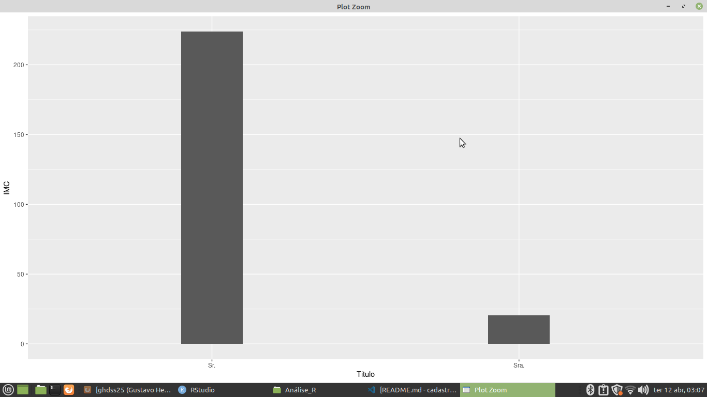
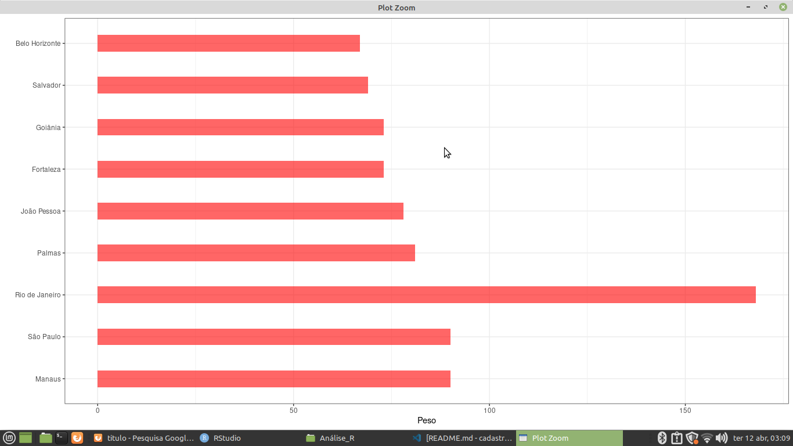
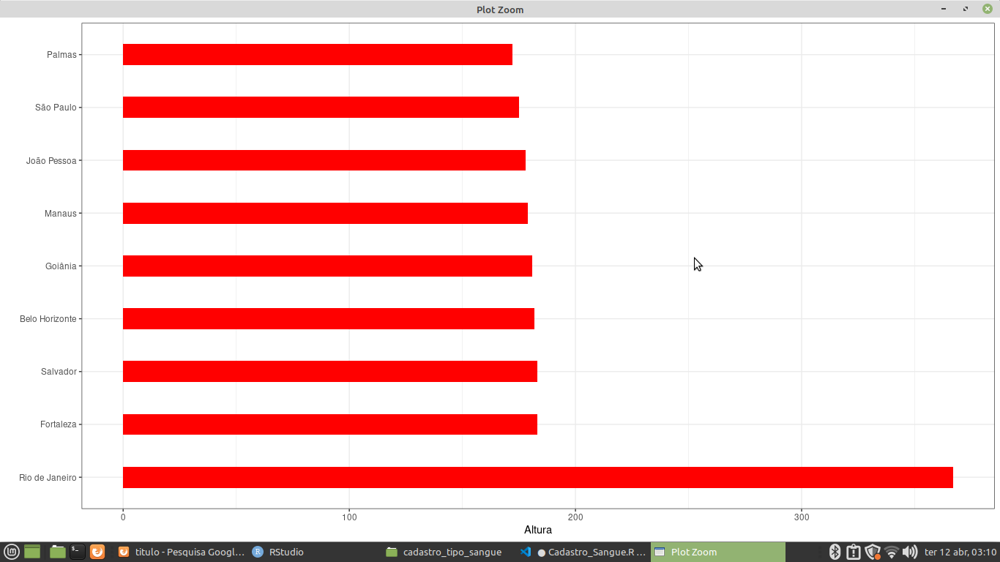
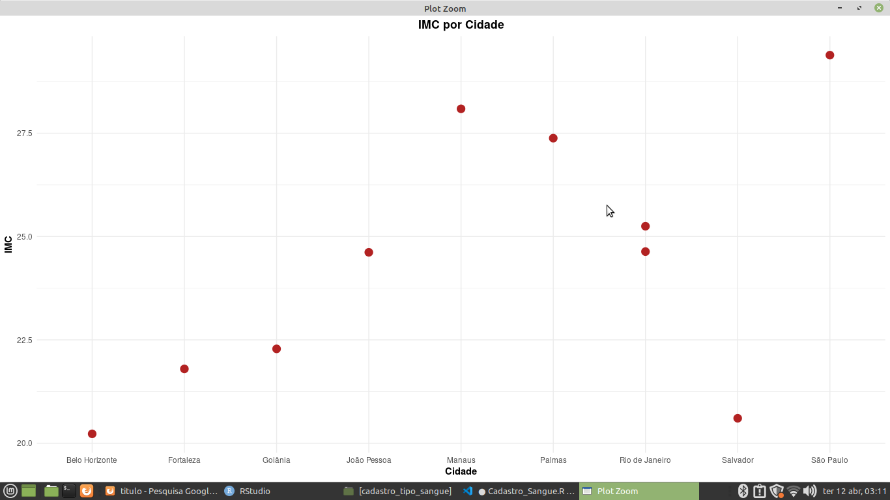
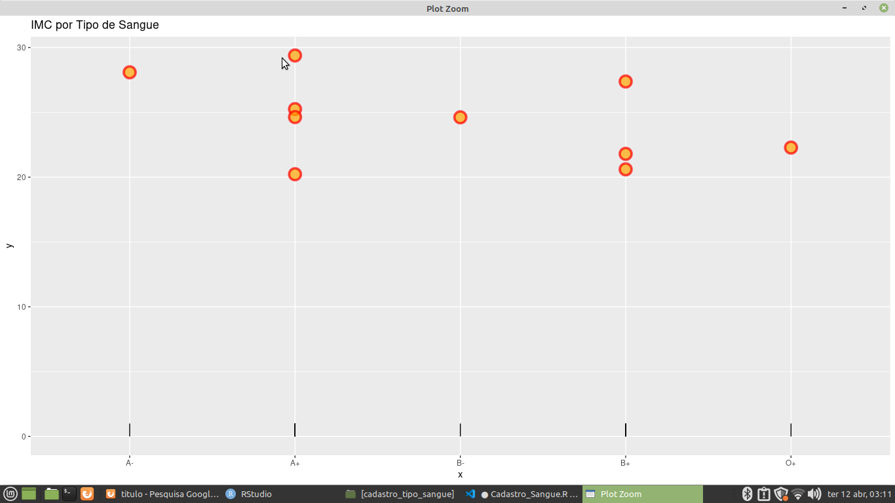
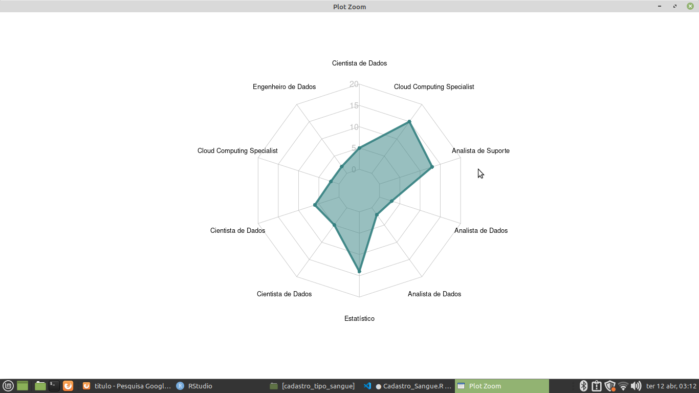
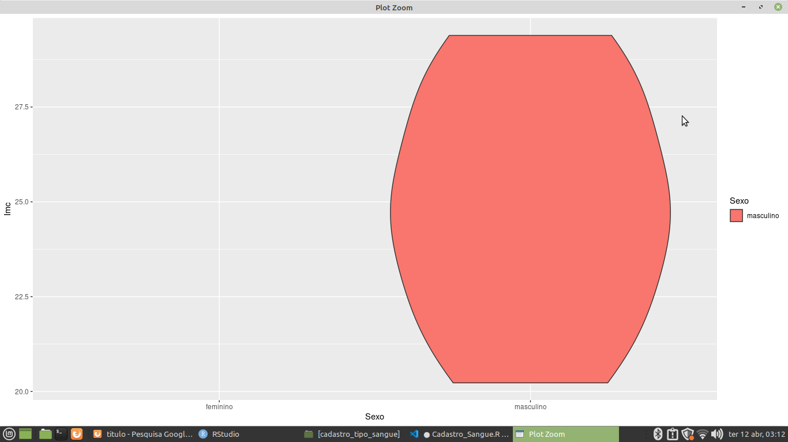
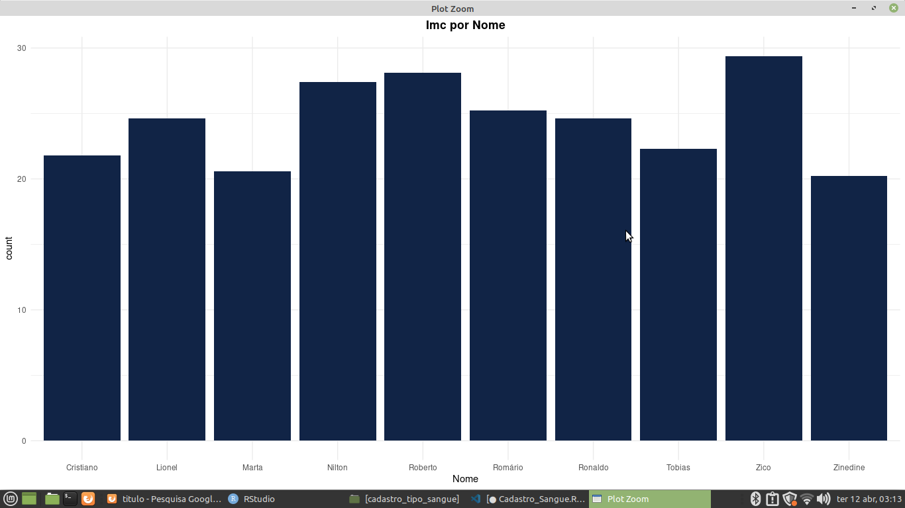

## Sobre o Projeto

** Cadastro de Tipos Sanguineos ** 

* Planilha de dados obtida pela Data Science Academy, que tem como objetivo analisar os cadastros dos tipos sanguineos dos doadores de sangue e revelar se o doador está apto ou não a doar sangue pelo índice de massa corpórea. 

## Tarefas para a planilhia Cadastro de Tipos Sanguineos

** IMC por Título ** 

** Altura  ** 

** Peso e Altura por Cidade **

** IMC por Cidade ** 

** IMC por Tipo Sanguineo **

** IMC por Profissão ** 

** IMC por Sexo ** 

** IMC por Nome ** 

** Ultima Consulta de IMC por Ano **

** Imc por Sexo e Profissão **

** Imc por Tipo Sanguineo e Cidade ** 

## Passos para a tarefa 

    1 - Importando o caminho do disco para a Linguagem 
    2 - Lendo o caminho do disco 
    3 - Lendo as Bibliotecas para gerar gráficos e Agrupamento de dados
    4 - Agrupando das colunas, para realizar calculos do Imc pelas colunas relacionadas
    5 - Usando um pacote de biblioteca Esquisse para gerar gráficos .
    6 - Plotando Gráficos para gerar as análises prévias. 
    
## Tecnologias Utilizadas 

** O projeto foi desenvolvido com as seguintes tecnologia ** 

- [R](https://www.r-project.org/)

## Pacotes Utilizados 

** Pacotes para a sessão de agrupamentos e consultas de colunas e geração de gráficos 

- [tidyr](https://tidyr.tidyverse.org/)
- [dplyr](https://dplyr.tidyverse.org/)
- [esquisse](https://www.littlemissdata.com/fdf/esquisse)
- [ggplot2](https://ggplot2.tidyverse.org/) 
- [tidyverse](https://www.tidyverse.org/) 
- [forcats](https://forcats.tidyverse.org/)
- [fmsb](https://livro.curso-r.com/7-6-forcats.html)
- [viridis](https://ggplot2.tidyverse.org/reference/scale_viridis.html) 
- [hrbrthemes](https://www.r-bloggers.com/2019/01/hrbrthemes-0-6-0-on-cran-other-in-development-package-news/)

## Bibliotecas para Geração de Gráficos do Cadastro de Tipos Sanguineos 

- [geom_bar](https://plotly.com/ggplot2/geom_bar/)
- [geom_boxplot](https://r-graph-gallery.com/boxplot.html)
- [geom_violin](https://ggplot2.tidyverse.org/reference/geom_violin.html)
- [geom_line](http://www.sthda.com/english/wiki/ggplot2-line-plot-quick-start-guide-r-software-and-data-visualization)
- [geom_point](https://plotly.com/ggplot2/geom_point/) 
- [geom_segment](https://ggplot2.tidyverse.org/reference/geom_segment.html)
- [geom_tile](https://r-charts.com/correlation/heat-map-ggplot2/)

- [radarchart](https://www.datanovia.com/en/blog/beautiful-radar-chart-in-r-using-fmsb-and-ggplot-packages/) 

## Imagens dos Gráficos do Cadastro de Tipos Sanguineos 

** IMC por Título ** 

** Peso por Altura ** 

** Peso por Cidade **

** IMC por Cidade ** 

** IMC por Tipo Sanguineo **

** IMC por Profissão ** 

** IMC por Sexo ** 
 

** IMC por Nome ** 
 

** Ultima Consulta de IMC por Ano **
 

** Imc por Sexo e Profissão **
 

** Imc por Tipo Sanguineo e Cidade ** 
 

Desenvolvido por Gustavo Henrique de Souza Silva

